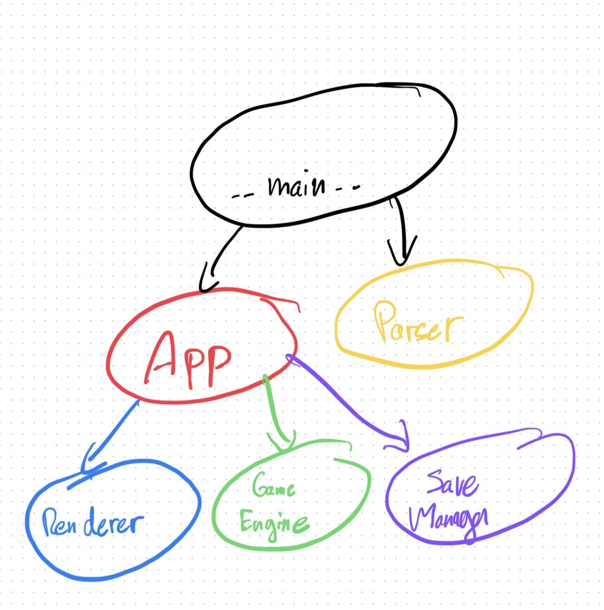
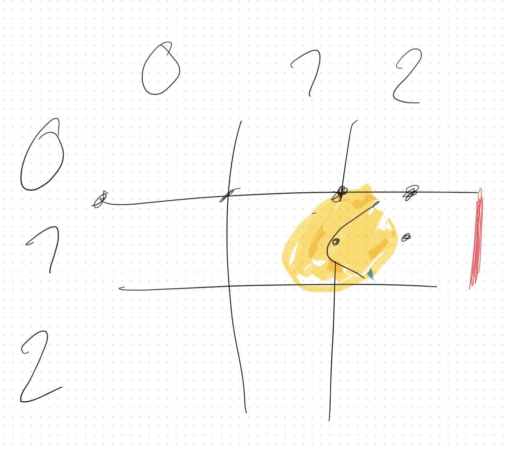

*This project has been created as part of the 42 curriculum by trgascoi, bfitte.*

# Description

**Pacman** was a project that asked us to recreate the famous game of the eponymous name.

### Goal

Learn how to handle all the issues involved in creating a video game (key mapping, rendering, game logic, etc.) and create an adapted code architecture
with effective feedback loop.

### Overview

The goal of pacman is to control a little yellow circle with a mouth called
"pacman" to eat all the "pacgums" in a maze while avoiding beeing eatten by
4 ghosts. When all pacgums are eaten, the player goes to the next level. A game
contains at least 10 levels. Finishing the last level leads to the victory.

It's eat or be eaten.

# Instructions

### Installation

To install the dependencies, you have to use the command
```BASH
make install
```

If you want to build the package for exporting it, use the command
```BASH
make package
```

### Execution

If you built the package before, simply open the executable called "pacman".

Otherwise, use the command
```BASH
make run
```

If you want to load a different configuration file, use
```BASH
uv run python -m src \<config file path\>
```

#### Configuration

In the configuration file, you'll can find theses different keys and values

| Field | Type | Constraints & Default Value | Role |
| :--- | :--- | :--- | :--- |
| `highscore_filename` | `str` | Required.<br>*(Must end with `.json`)* | Defines the path and filename for saving highscores. |
| `width` | `int` | Required.<br>*(1 ≤ value ≤ 20)* | Defines the width of the maze grid. |
| `height` | `int` | Required.<br>*(1 ≤ value ≤ 20)* | Defines the height of the maze grid. |
| `lives` | `int` | Default: `3`<br>*(value ≥ 1)* | Represents the initial number of lives for the player. |
| `points_per_pacgum` | `int` | Required.<br>*(value ≥ 0)* | Sets the points awarded for eating a standard pacgum. |
| `points_per_super_pacgum` | `int` | Required.<br>*(value ≥ 0)* | Sets the points awarded for eating a super-pacgum. |
| `points_per_ghost` | `int` | Required.<br>*(value ≥ 0)* | Sets the points awarded for eating a vulnerable ghost. |
| `seed` | `str` \| `int` \| `None` | Default: `None` (Optional) | Sets the seed for the random number generator to ensure reproducible maze generation. |
| `level_max_time` | `int` | Required.<br>*(value ≥ 1)* | Defines the maximum time allowed to complete a level. |
| `levels_to_generate` | `int` | Default: `10`<br>*(value ≥ 10)* | Determines the total number of levels to generate. |

# Implementation

## Highscore

When a game is finished, the player is asked to enter his name (into the **GameOverScreen** and **VictoryScreen** GUIs). Then, if the player is better than the 10 best players in place, it enters the highscores and remove the least good one. If there is less than 10 players, it is just added.

In the **MainScreen**, we can access the **HighscoresScreen** where an ordered list of the 10 best highscores is displayed.

All the highscores are stored in a JSON file with a name chosen by the configurator.

## Maze Generation

The *a_maze_ing*/***mazegen*** package was provided by 42 as a wheel (.whl) file. This file is in the "libs" directory and is installed via uv with the pyproject.toml file.

This library provides a **MazeGenerator** class that we use in the App class.

## General Software Architecture

The project is built in a full object-oriented way. Each file corresponds to a unique class and has its name.

The project is built in two main parts (GameEngine and Renderer) that are handled by a unique big entity (App). The GameEngine handles all the game mechanics (such as character movements, collisions, global states, win, lose...). The Renderer aims to display each element of the game according to the GameEngine (it controls movement, sprite animations, GUI...).

Here is a schema that we made at the beginning of the project to guide us to follow the same organisation through all the projet.



## Other Libraries

All the rendering is made with the Python wrapper of the **42 MiniLibX** (MLX) library.

The parsing is done with the validation system of **Pydantic**.

The code is linted with **flake8** and **mypy**.

The packaging system is of course done with **pyinstaller**.

# Project Management

To brainstorm complex things, we used an iPad with the Freeform app to draw wonderful schemas such as the one before or this one representing a collision issue:



To keep security in place, we used git branches and pull requests on [GitHub](https://github.com/tristan-gscn/pacman). We used all along two main branches: **rendering** and **game**.

We ensured all along that we followed the architecture that we decided in the beginning to keep to code clean and suitable.

# Resources

- [MLX Documentation](https://harm-smits.github.io/42docs/libs/minilibx/getting_started.html)
- [Pacman Ghosts Behaviour](https://www.etaletaculture.fr/geek/les-4-fantomes-de-pac-man-ont-un-secret/)

All other researches have been done with AI.

---

AI was also used to fix bugs, find bugs and build packaging pyinstaller system.

---

All the sprites have been done with Inkscape by *trgascoi*.

The game logo comes from [here](https://logos-world.net/wp-content/uploads/2023/03/Pac-Man-Logo.png) (found on Google Image).